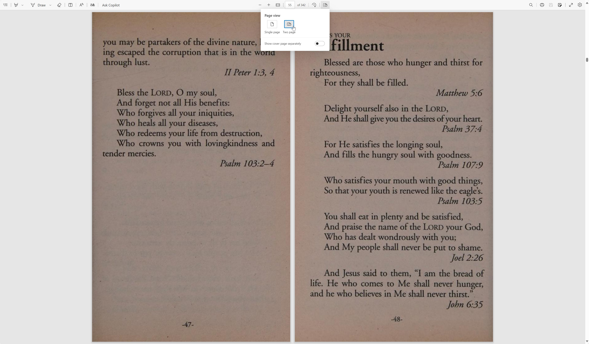

<div align="center">
  
</div>

[**Download PDF**](https://drive.google.com/uc?export=download&id=1PMauVuzB0d89nCumWAyIy1D_5ku_nh3L)
or
[View PDF](https://drive.google.com/file/d/1PMauVuzB0d89nCumWAyIy1D_5ku_nh3L/view?usp=sharing)

> Recommended to read in two-column (two-page or landscape or horizontal) layout (orientation). Microsoft Edge web browser has this feature built-in, some other web browsers might too. See example why its useful and how to enable it in Edge in the image below.



**Repository Folder Structure**

```
code/
└── Python files that help automate some tedious tasks...
images/
└── some miscellaneous images that are used in the repository...
pages/
└── all pages of the GOD's Promises For your every need book in JPEG image format...
```
